# Smart-MDT reproducible evaluation report

## Overview

- Input benchmark: `rust_results_final_freeze_r10_1fbfa30`
- Benchmark rows: 7360
- Datasets: 46
- Methods: 8
- Bootstrap resamples: 10000
- Bootstrap seed: 20260718
- Confidence level: 95.0%
- Missing optional inputs: none

The framework validates the benchmark schema before analysis, averages
repeated runs and depths within each dataset, and uses datasets as the
independent blocks for every significance test.

## Executive findings

- Best mean accuracy: **CALS-MDT**
  (0.864820)
- Smallest mean tree: **CompactExplain**
  (11.124 nodes)
- Fastest mean fit time: **Unary**
  (0.047 seconds)
- Best mean AXp length: **CompactExplain**
  (2.721)

- For CALS-MDT vs CompactExplain on Accuracy, the right-hand method was lower by 0.0047 (95% bootstrap CI [-0.0073, -0.0022], raw p=0.001873, Holm-adjusted p=0.01124, paired Cohen's d=-0.523, medium effect).

- For SmartCertified vs CALS-MDT on Accuracy, the right-hand method was higher by 0.0052 (95% bootstrap CI [0.0014, 0.0092], raw p=0.005784, Holm-adjusted p=0.02892, paired Cohen's d=0.385, small effect).

- For CALS-MDT vs CompactExplain on Fit time (seconds), the right-hand method was lower by 6.0334 (95% bootstrap CI [-7.8811, -4.3309], raw p=2.842e-14, Holm-adjusted p=4.263e-13, paired Cohen's d=-0.965, large effect).

- For SmartCertified vs CALS-MDT on Fit time (seconds), the right-hand method was higher by 8.1640 (95% bootstrap CI [5.6094, 11.0623], raw p=5.446e-10, Holm-adjusted p=7.624e-09, paired Cohen's d=0.845, large effect).

- For SmartCertified vs CALS-MDT on Tree nodes, the right-hand method was lower by 37.9587 (95% bootstrap CI [-45.8178, -30.6804], raw p=3.522e-09, Holm-adjusted p=4.576e-08, paired Cohen's d=-1.411, large effect).

- For SmartCertified vs CompactExplain on Tree nodes, the right-hand method was lower by 39.5652 (95% bootstrap CI [-49.0461, -30.9891], raw p=3.52e-09, Holm-adjusted p=4.576e-08, paired Cohen's d=-1.254, large effect).

## Descriptive statistics

| Method | Metric | N | Mean | Median | Std. | 95% CI lower | 95% CI upper |
| --- | --- | --- | --- | --- | --- | --- | --- |
| Unary | Accuracy | 46 | 0.859 | 0.901 | 0.118 | 0.824 | 0.894 |
| Unary | Tree nodes | 46 | 53.235 | 44.050 | 31.364 | 43.921 | 62.549 |
| Unary | Predicate literals | 46 | 26.117 | 21.525 | 15.682 | 21.460 | 30.774 |
| Unary | Mean AXp length | 46 | 3.927 | 3.916 | 1.198 | 3.571 | 4.282 |
| Unary | Fit time (seconds) | 46 | 0.047 | 0.012 | 0.094 | 0.019 | 0.075 |
| Horn | Accuracy | 46 | 0.860 | 0.903 | 0.119 | 0.824 | 0.895 |
| Horn | Tree nodes | 46 | 51.217 | 41.050 | 32.575 | 41.544 | 60.891 |
| Horn | Predicate literals | 46 | 50.217 | 40.050 | 32.575 | 40.544 | 59.891 |
| Horn | Mean AXp length | 46 | 5.137 | 5.110 | 1.510 | 4.689 | 5.586 |
| Horn | Fit time (seconds) | 46 | 0.065 | 0.017 | 0.135 | 0.025 | 0.105 |
| AntiHorn | Accuracy | 46 | 0.860 | 0.896 | 0.118 | 0.825 | 0.895 |
| AntiHorn | Tree nodes | 46 | 51.487 | 39.700 | 33.015 | 41.683 | 61.291 |
| AntiHorn | Predicate literals | 46 | 50.487 | 38.700 | 33.015 | 40.683 | 60.291 |
| AntiHorn | Mean AXp length | 46 | 5.553 | 5.115 | 2.057 | 4.943 | 6.164 |
| AntiHorn | Fit time (seconds) | 46 | 0.066 | 0.017 | 0.142 | 0.024 | 0.109 |
| Square2CNF | Accuracy | 46 | 0.859 | 0.890 | 0.120 | 0.824 | 0.895 |
| Square2CNF | Tree nodes | 46 | 50.807 | 40.450 | 33.360 | 40.900 | 60.713 |
| Square2CNF | Predicate literals | 46 | 99.613 | 78.900 | 66.719 | 79.800 | 119.426 |
| Square2CNF | Mean AXp length | 46 | 6.357 | 6.122 | 2.179 | 5.710 | 7.004 |
| Square2CNF | Fit time (seconds) | 46 | 0.444 | 0.073 | 1.021 | 0.141 | 0.748 |
| Boolean Affine/GF(2) | Accuracy | 46 | 0.854 | 0.881 | 0.119 | 0.818 | 0.889 |
| Boolean Affine/GF(2) | Tree nodes | 46 | 53.126 | 47.300 | 32.564 | 43.456 | 62.796 |
| Boolean Affine/GF(2) | Predicate literals | 46 | 60.042 | 53.700 | 35.198 | 49.590 | 70.495 |
| Boolean Affine/GF(2) | Mean AXp length | 46 | 7.897 | 8.185 | 2.332 | 7.205 | 8.590 |
| Boolean Affine/GF(2) | Fit time (seconds) | 46 | 0.162 | 0.031 | 0.346 | 0.060 | 0.265 |
| SmartCertified | Accuracy | 46 | 0.860 | 0.895 | 0.119 | 0.824 | 0.895 |
| SmartCertified | Tree nodes | 46 | 50.689 | 42.300 | 30.983 | 41.488 | 59.890 |
| SmartCertified | Predicate literals | 46 | 30.123 | 26.075 | 17.159 | 25.027 | 35.218 |
| SmartCertified | Mean AXp length | 46 | 4.184 | 4.195 | 1.156 | 3.841 | 4.527 |
| SmartCertified | Fit time (seconds) | 46 | 0.731 | 0.113 | 1.640 | 0.244 | 1.218 |
| CALS-MDT | Accuracy | 46 | 0.865 | 0.896 | 0.118 | 0.830 | 0.900 |
| CALS-MDT | Tree nodes | 46 | 12.730 | 12.800 | 8.411 | 10.233 | 15.228 |
| CALS-MDT | Predicate literals | 46 | 14.936 | 13.600 | 11.127 | 11.631 | 18.240 |
| CALS-MDT | Mean AXp length | 46 | 2.976 | 2.809 | 1.567 | 2.511 | 3.442 |
| CALS-MDT | Fit time (seconds) | 46 | 8.895 | 5.528 | 9.789 | 5.988 | 11.801 |
| CompactExplain | Accuracy | 46 | 0.860 | 0.895 | 0.118 | 0.825 | 0.895 |
| CompactExplain | Tree nodes | 46 | 11.124 | 9.850 | 7.203 | 8.985 | 13.263 |
| CompactExplain | Predicate literals | 46 | 12.786 | 9.550 | 11.187 | 9.464 | 16.108 |
| CompactExplain | Mean AXp length | 46 | 2.721 | 2.553 | 1.693 | 2.219 | 3.224 |
| CompactExplain | Fit time (seconds) | 46 | 2.861 | 1.752 | 3.950 | 1.688 | 4.034 |

## Pairwise significance

Positive differences and effect sizes mean the right-hand method has the larger
metric value. Whether that is preferable depends on the metric: accuracy is
maximized, whereas nodes, literals, AXp length, and runtime are minimized.
Holm-adjusted p-values control family-wise error across the configured tests.

| Comparison | Metric | Pairs | Mean diff. | p-value | Holm p-value | CI lower | CI upper | Cliff's delta | Cliff magnitude | Cohen's d | d magnitude |
| --- | --- | --- | --- | --- | --- | --- | --- | --- | --- | --- | --- |
| SmartCertified vs CALS-MDT | Accuracy | 46 | 0.005 | 0.006 | 0.029 | 0.001 | 0.009 | 0.034 | negligible | 0.385 | small |
| SmartCertified vs CALS-MDT | Tree nodes | 46 | -37.959 | 0.000 | 0.000 | -45.818 | -30.680 | -0.863 | large | -1.411 | large |
| SmartCertified vs CALS-MDT | Predicate literals | 46 | -15.187 | 0.000 | 0.000 | -19.710 | -10.872 | -0.552 | large | -0.978 | large |
| SmartCertified vs CALS-MDT | Mean AXp length | 46 | -1.207 | 0.000 | 0.000 | -1.635 | -0.768 | -0.491 | large | -0.803 | large |
| SmartCertified vs CALS-MDT | Fit time (seconds) | 46 | 8.164 | 0.000 | 0.000 | 5.609 | 11.062 | 0.871 | large | 0.845 | large |
| SmartCertified vs CompactExplain | Accuracy | 46 | 0.001 | 0.871 | 0.871 | -0.004 | 0.005 | 0.000 | negligible | 0.041 | negligible |
| SmartCertified vs CompactExplain | Tree nodes | 46 | -39.565 | 0.000 | 0.000 | -49.046 | -30.989 | -0.910 | large | -1.254 | large |
| SmartCertified vs CompactExplain | Predicate literals | 46 | -17.337 | 0.000 | 0.000 | -23.148 | -11.750 | -0.647 | large | -0.866 | large |
| SmartCertified vs CompactExplain | Mean AXp length | 46 | -1.463 | 0.000 | 0.000 | -1.962 | -0.957 | -0.617 | large | -0.821 | large |
| SmartCertified vs CompactExplain | Fit time (seconds) | 46 | 2.131 | 0.000 | 0.000 | 1.132 | 3.300 | 0.698 | large | 0.568 | medium |
| CALS-MDT vs CompactExplain | Accuracy | 46 | -0.005 | 0.002 | 0.011 | -0.007 | -0.002 | -0.032 | negligible | -0.523 | medium |
| CALS-MDT vs CompactExplain | Tree nodes | 46 | -1.607 | 0.404 | 0.807 | -3.511 | 0.102 | -0.105 | negligible | -0.253 | small |
| CALS-MDT vs CompactExplain | Predicate literals | 46 | -2.150 | 0.128 | 0.383 | -4.110 | -0.317 | -0.138 | negligible | -0.328 | small |
| CALS-MDT vs CompactExplain | Mean AXp length | 46 | -0.255 | 0.032 | 0.130 | -0.543 | 0.057 | -0.125 | negligible | -0.243 | small |
| CALS-MDT vs CompactExplain | Fit time (seconds) | 46 | -6.033 | 0.000 | 0.000 | -7.881 | -4.331 | -0.496 | large | -0.965 | large |

## Dataset analysis

The accuracy-rank Nemenyi critical difference is
1.548 across 46 datasets.

| Method | Wins | Average rank |
| --- | --- | --- |
| CALS-MDT | 15 | 3.120 |
| Unary | 6 | 4.130 |
| SmartCertified | 5 | 4.228 |
| Horn | 2 | 4.370 |
| CompactExplain | 9 | 4.522 |
| Square2CNF | 4 | 4.598 |
| AntiHorn | 3 | 4.685 |
| Boolean Affine/GF(2) | 2 | 6.348 |

The complete per-dataset table is available in
[`dataset_summary.csv`](../tables/dataset_summary.csv).

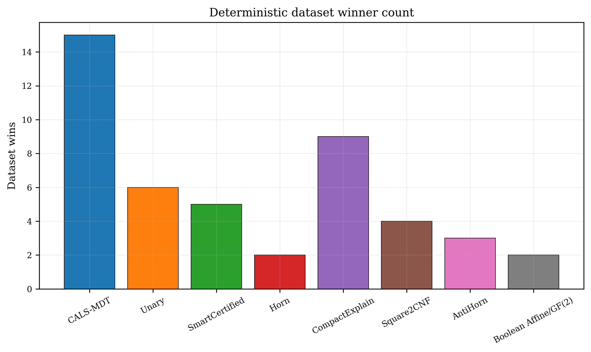

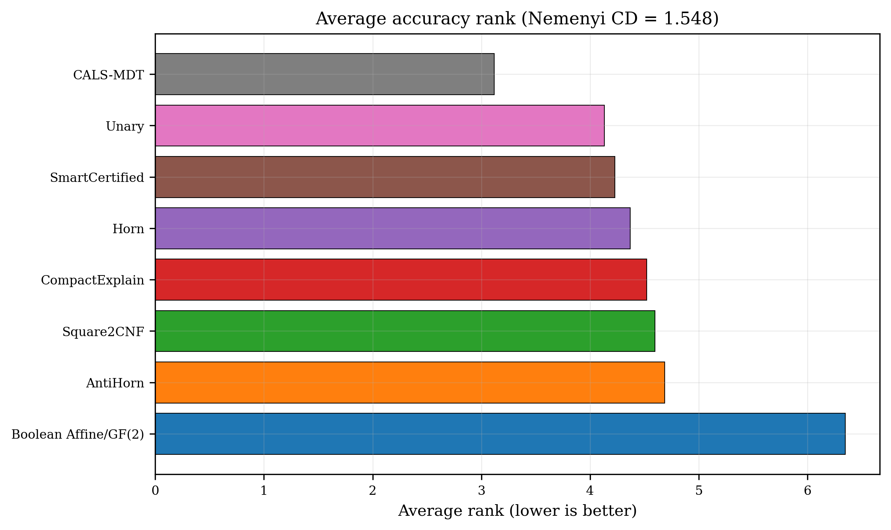

## Accuracy, complexity, explanation, and runtime figures

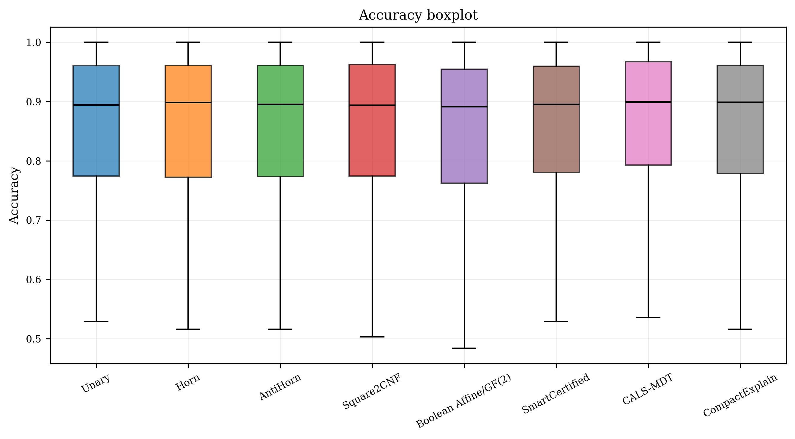

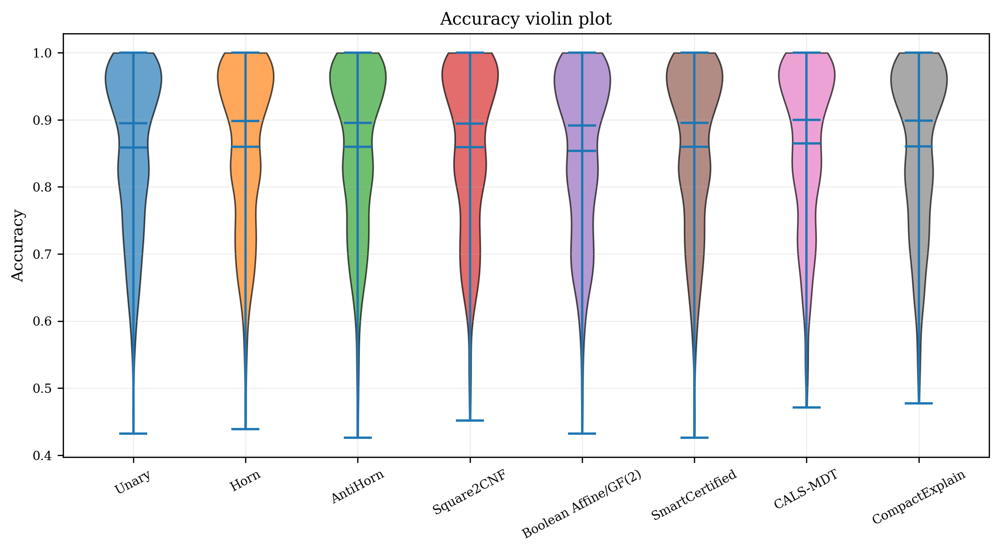

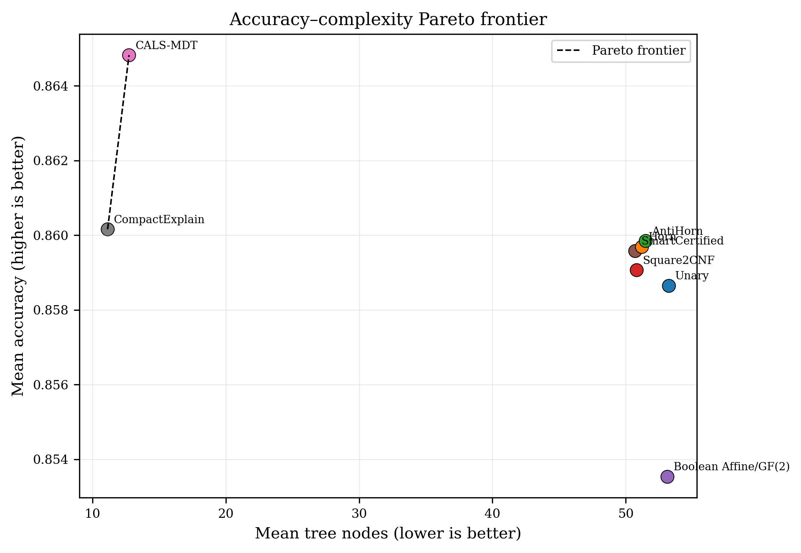

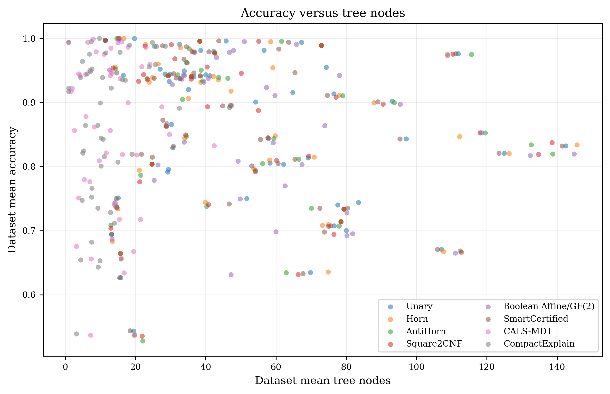

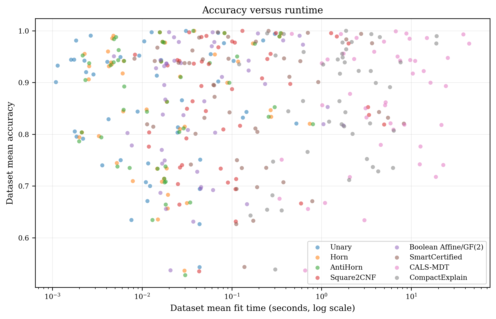

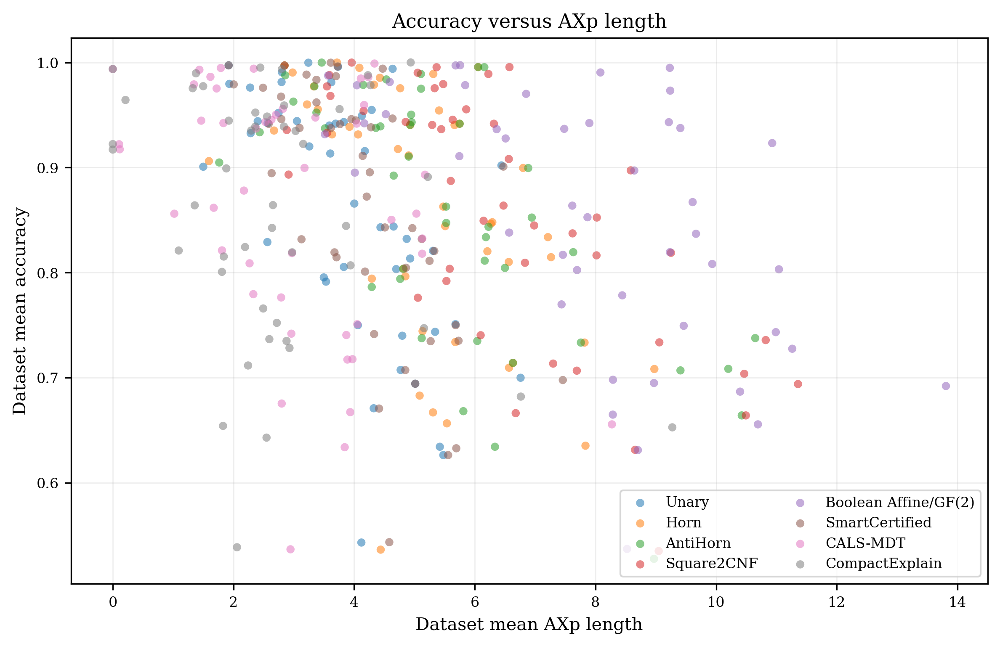

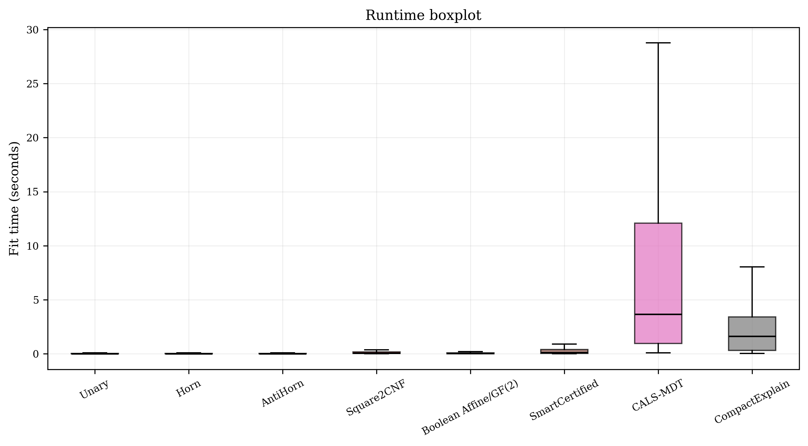

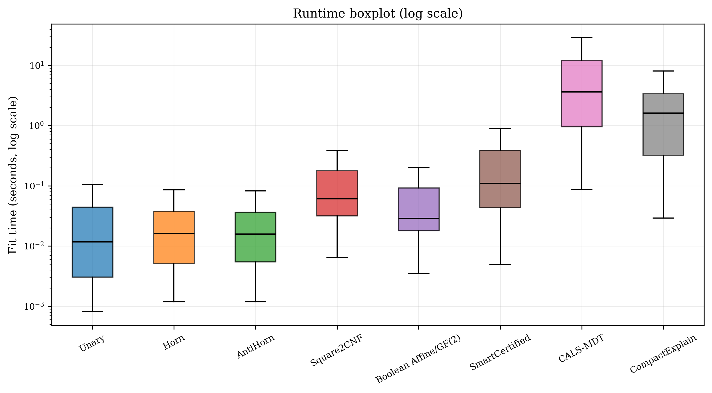

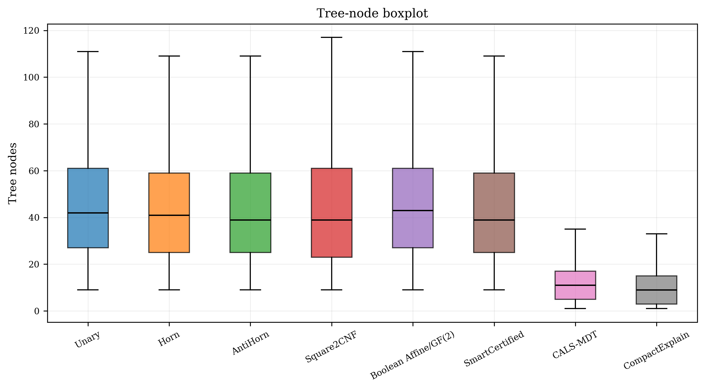

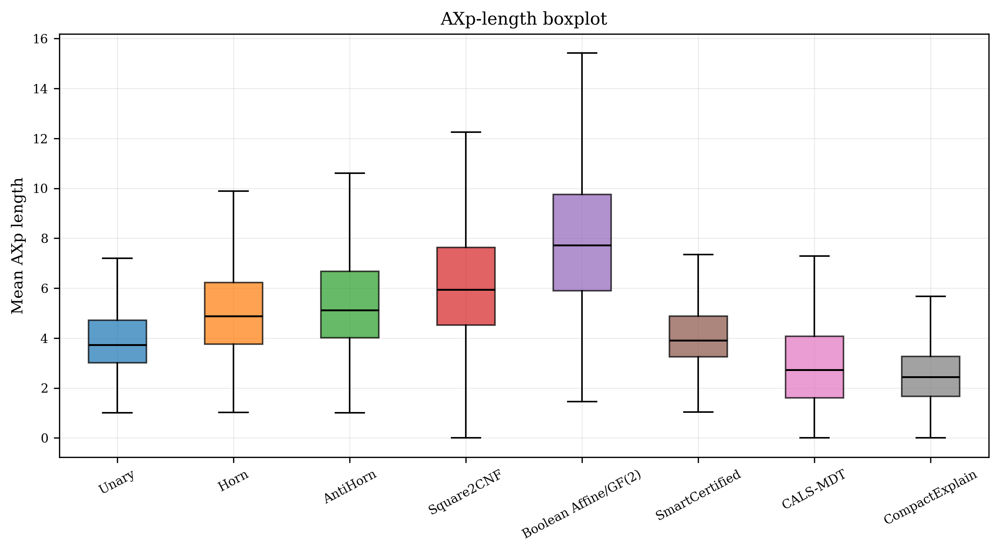

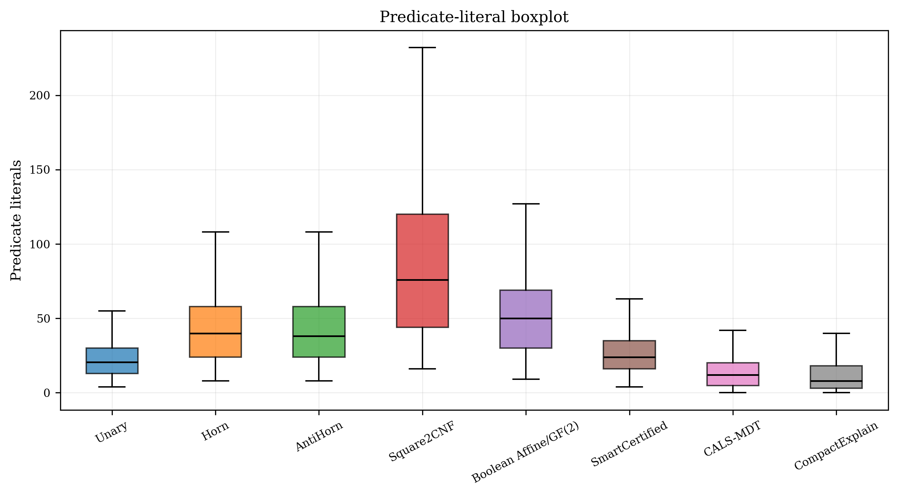

## Certification

| Audit item | Count | Denominator | Percentage | evidence_available | status |
| --- | --- | --- | --- | --- | --- |
| datasets | 46 | 46 | 100.000 | 1 | pass |
| rows | 7360 | 7360 | 100.000 | 1 | pass |
| theorem_certified_rows | 7360 | 7360 | 100.000 | 1 | pass |
| empirical_rows | 0 | 7360 | 0.000 | 1 | pass |
| forbidden_predicates | 0 | 7360 | 0.000 | 1 | pass |
| feature_label_leakage | 0 | 46 | 0.000 | 1 | pass |
| path_violations | 0 | 7360 | 0.000 | 1 | pass |
| cached_subtree_violations | 0 | 7360 | 0.000 | 1 | pass |
| empirical_fallbacks | 0 | 7360 | 0.000 | 1 | pass |
| axp_evidence_violations | 0 | 7360 | 0.000 | 1 | pass |
| full_row_axp_violations | 0 | 7360 | 0.000 | 1 | pass |
| skipped_datasets | 0 | 46 | 0.000 | 1 | pass |

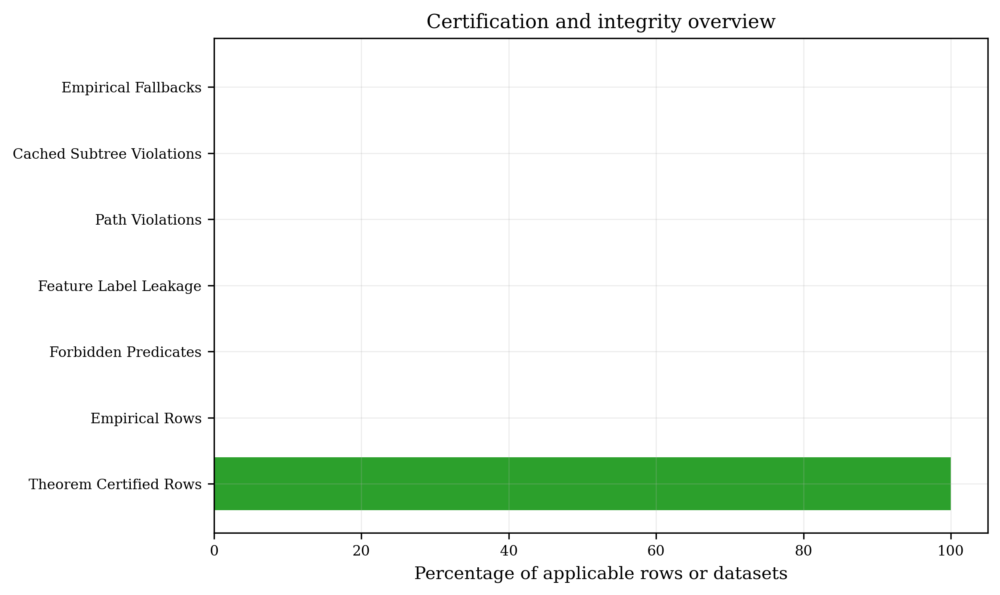

## Benchmark warnings

The warning summary contains 11 grouped records.

| dataset | method | warning_type | warning_records | affected_rows | percentage |
| --- | --- | --- | --- | --- | --- |
| balance-scale-bin | cals_compact_explain | method_all_constant_trees | 1 | 20 | 2.041 |
| balance-scale-bin | cals_compact_explain | method_all_zero_axp | 1 | 20 | 2.041 |
| seismic_bumps-bin | cals_compact_explain | method_all_constant_trees | 1 | 20 | 2.041 |
| seismic_bumps-bin | cals_compact_explain | method_all_zero_axp | 1 | 20 | 2.041 |
| winequality-red-bin | all | suspicious_majority_rate | 1 | 1 | 2.041 |
| winequality-red-bin | cals | high_accuracy_tiny_tree | 20 | 20 | 40.816 |
| winequality-red-bin | cals | method_all_constant_trees | 1 | 20 | 2.041 |
| winequality-red-bin | cals | method_all_zero_axp | 1 | 20 | 2.041 |
| winequality-red-bin | cals_compact_explain | high_accuracy_tiny_tree | 20 | 20 | 40.816 |
| winequality-red-bin | cals_compact_explain | method_all_constant_trees | 1 | 20 | 2.041 |
| winequality-red-bin | cals_compact_explain | method_all_zero_axp | 1 | 20 | 2.041 |

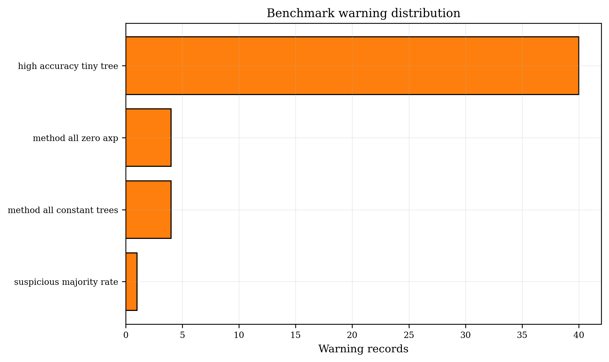

## Search analysis

| method_label | rows | greedy_nodes | lookahead_nodes | branch_and_bound_activations | branch_and_bound_avoided | cache_activations | candidate_savings | search_time_seconds | cache_hits |
| --- | --- | --- | --- | --- | --- | --- | --- | --- | --- |
| Unary | 920 | 0.000 | 0.000 | 0.000 | 0.000 | 0.000 | 0.000 | 43.420 | 2256713.000 |
| Horn | 920 | 0.000 | 0.000 | 0.000 | 0.000 | 0.000 | 0.000 | 59.647 | 4417514.000 |
| AntiHorn | 920 | 0.000 | 0.000 | 0.000 | 0.000 | 0.000 | 0.000 | 61.040 | 4367932.000 |
| Square2CNF | 920 | 0.000 | 0.000 | 0.000 | 0.000 | 0.000 | 0.000 | 408.936 | 5111175.000 |
| Boolean Affine/GF(2) | 920 | 0.000 | 0.000 | 0.000 | 0.000 | 0.000 | 0.000 | 149.459 | 4906929.000 |
| SmartCertified | 920 | 0.000 | 0.000 | 0.000 | 0.000 | 0.000 | 0.000 | 672.113 | 18141420.000 |
| CALS-MDT | 920 | 34304.000 | 0.000 | 29610.000 | 0.000 | 55196.000 | 1584533.000 | 8182.759 | 38342310.000 |
| CompactExplain | 920 | 24053.000 | 11604.000 | 0.000 | 27756.000 | 56805.000 | 458777.000 | 2632.005 | 24730873.000 |

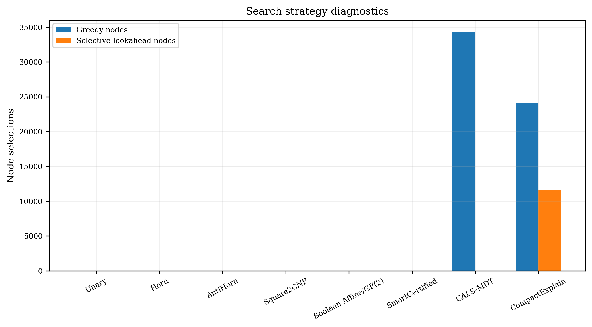

## Pruning analysis

| method_label | rows | validation_accuracy_before | validation_accuracy_after | validation_balanced_accuracy_before | validation_balanced_accuracy_after | validation_minority_recall_before | validation_minority_recall_after | nodes_before | nodes_after | tree_reduction_percentage |
| --- | --- | --- | --- | --- | --- | --- | --- | --- | --- | --- |
| Unary | 920 | 0.000 | 0.000 | 0.000 | 0.000 | 0.000 | 0.000 | 53.235 | 53.235 | 0.000 |
| Horn | 920 | 0.000 | 0.000 | 0.000 | 0.000 | 0.000 | 0.000 | 51.217 | 51.217 | 0.000 |
| AntiHorn | 920 | 0.000 | 0.000 | 0.000 | 0.000 | 0.000 | 0.000 | 51.487 | 51.487 | 0.000 |
| Square2CNF | 920 | 0.000 | 0.000 | 0.000 | 0.000 | 0.000 | 0.000 | 50.807 | 50.807 | 0.000 |
| Boolean Affine/GF(2) | 920 | 0.000 | 0.000 | 0.000 | 0.000 | 0.000 | 0.000 | 53.126 | 53.126 | 0.000 |
| SmartCertified | 920 | 0.000 | 0.000 | 0.000 | 0.000 | 0.000 | 0.000 | 50.689 | 50.689 | 0.000 |
| CALS-MDT | 920 | 0.854 | 0.879 | 0.789 | 0.805 | 0.673 | 0.670 | 46.133 | 12.730 | 72.405 |
| CompactExplain | 920 | 0.854 | 0.869 | 0.789 | 0.786 | 0.672 | 0.637 | 46.659 | 11.124 | 76.159 |

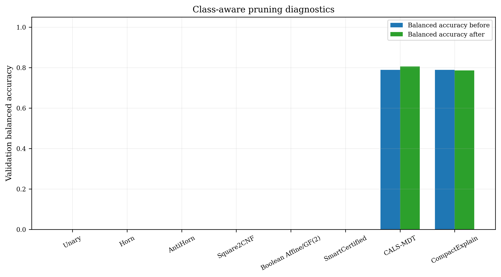

## AXp analysis

| method_label | rows | mean_axp | median_axp | std_axp | minimum_axp | maximum_axp | family_usage |
| --- | --- | --- | --- | --- | --- | --- | --- |
| Unary | 920 | 3.927 | 3.728 | 1.531 | 0.000 | 9.618 | Unary:24028 |
| Horn | 920 | 5.137 | 4.887 | 1.892 | 0.000 | 12.863 | Horn:23100 |
| AntiHorn | 920 | 5.553 | 5.114 | 2.389 | 0.000 | 14.523 | AntiHorn:23224 |
| Square2CNF | 920 | 6.357 | 5.938 | 2.575 | 0.000 | 17.542 | Square2Cnf:22911 |
| Boolean Affine/GF(2) | 920 | 7.897 | 7.717 | 2.896 | 0.000 | 20.000 | Affine:23978 |
| SmartCertified | 920 | 4.184 | 3.907 | 1.531 | 0.000 | 10.673 | Affine:1121 \| AntiHorn:682 \| Horn:2348 \| Square2Cnf:150 \| Unary:18556 |
| CALS-MDT | 920 | 2.976 | 2.724 | 2.135 | 0.000 | 14.887 | Affine:354 \| AntiHorn:586 \| Horn:1586 \| Square2Cnf:1871 \| Unary:999 |
| CompactExplain | 920 | 2.721 | 2.438 | 2.096 | 0.000 | 15.491 | Affine:281 \| AntiHorn:414 \| Horn:1063 \| Square2Cnf:1720 \| Unary:1179 |

## Discussion

The results should be interpreted jointly: predictive performance alone does
not establish compactness, speed, explanation quality, or certification.
Paired tests preserve dataset blocks after averaging repeated runs and depths,
while bootstrap intervals resample datasets to quantify uncertainty in mean
paired differences. Effect-size
magnitudes supplement p-values and should be considered alongside practical
importance.

This report is deterministic for a fixed input folder and configuration.
The reproducibility manifest records input hashes, dependency versions, seeds,
and generated artifacts. Bootstrap intervals are reproducible because every
comparison and metric receives a stable seed derived from the configured base
seed.
